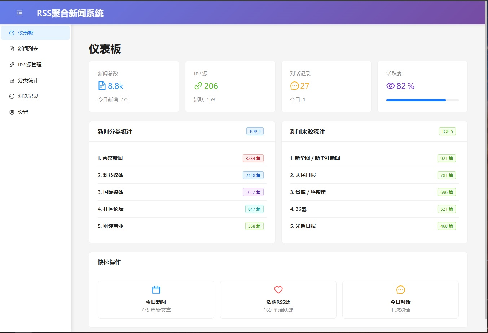

# RSS聚合新闻+LLM对话生成+语音合成系统

一个基于Go后端 + React前端的智能新闻聚合系统，支持RSS源管理、AI对话生成和语音合成。



## 功能特性

### RSS新闻管理
- ✅ 添加/编辑/删除RSS源
- ✅ 定时抓取新闻（可配置间隔）
- ✅ 分类统计与管理
- ✅ 新闻搜索与过滤
- ✅ 标记已读、收藏、忽略
- ✅ 新闻永久保留

### AI对话生成
- ✅ 支持多种对话模式（访谈、CEO采访、评论、聊天）
- ✅ 每日任务自动生成对话
- ✅ 可配置对话轮次和新闻数量
- ✅ 基于最新新闻生成智能对话
- ✅ 支持OpenAI、DeepSeek等LLM API

### 语音合成
- ✅ 支持多种TTS服务（OpenAI TTS、Azure等）
- ✅ 为不同角色设置不同音色
- ✅ 生成MP3音频文件
- ✅ 在线播放与下载

### 微信公众号推送
- ✅ 支持客服消息推送
- ✅ 每日任务自动推送
- ✅ 模板消息支持

## 技术栈

- **后端**: Go + Gin + GORM
- **前端**: React + Ant Design
- **数据库**: MySQL 8.0+
- **LLM**: OpenAI / DeepSeek
- **TTS**: OpenAI TTS / Azure

## 快速开始

### 环境要求
- Go 1.20+
- Node.js 16+
- MySQL 8.0+
- Windows 10/11

### 安装步骤

1. **克隆项目**
   ```bash
   git clone https://github.com/VikingsYip/rss-llm-tts.git
   cd rss-llm-tts
   ```

2. **配置数据库**
   - 创建MySQL数据库：`rss_llm_tts`
   - 复制环境配置：复制 `backend-go/.env.example` 为 `backend-go/.env`
   - 编辑 `backend-go/.env` 文件，配置数据库连接信息

3. **配置API密钥**
   在前端 Settings 页面配置：
   - LLM API（支持 OpenAI、DeepSeek 等）
   - TTS API
   - 微信公众号配置

4. **启动服务**
   ```bash
   # 双击运行 start.bat
   start.bat
   ```

### 访问地址

- **前端界面**: http://localhost:3002
- **后端API**: http://localhost:8080
- **健康检查**: http://localhost:8080/health

## 项目结构

```
rss-llm-tts/
├── backend-go/              # Go后端服务
│   ├── cmd/server/         # 入口
│   ├── internal/
│   │   ├── config/        # 配置
│   │   ├── database/      # 数据库
│   │   ├── handlers/      # HTTP处理
│   │   ├── middleware/     # 中间件
│   │   ├── models/        # 数据模型
│   │   └── services/      # 业务服务
│   └── .env
├── frontend/               # React前端
│   ├── src/
│   │   ├── components/    # React组件
│   │   ├── pages/        # 页面组件
│   │   ├── services/     # API服务
│   │   └── utils/        # 工具函数
│   └── package.json
├── start.bat              # 启动脚本
└── README.md
```

## 功能说明

### 每日任务
- 自动根据当天收藏的文章生成对话
- 定时执行（可配置时间）
- 自动推送到微信公众号
- 支持手动触发

### 对话类型
系统支持以下对话类型：
- `interview` - 主持人访谈IT大佬
- `ceo_interview` - 新闻从业者采访CEO
- `commentary` - 两位评论员分析新闻热点
- `chat` - 两位朋友聊天讨论
- `daily` - 每日任务自动生成

## 配置说明

### 前端配置（Settings页面）

在 Settings 页面可配置：
- LLM API（API URL、API Key、模型）
- TTS API
- 微信公众号（AppID、AppSecret、用户OpenID）
- 每日任务配置（执行时间、主持人、嘉宾、轮次）

### 环境变量配置

在 `backend-go/.env` 文件中配置：

```env
# 数据库配置
DB_HOST=localhost
DB_PORT=3306
DB_NAME=rss_llm_tts
DB_USER=root
DB_PASSWORD=your_password

# LLM API配置
LLM_API_URL=https://api.deepseek.com/v1/chat/completions
LLM_API_KEY=your_deepseek_api_key
LLM_MODEL=deepseek-chat

# 微信公众号配置
WECHAT_APP_ID=your_app_id
WECHAT_APP_SECRET=your_app_secret

# 代理配置（可选）
HTTP_PROXY_ENABLED=false
HTTP_PROXY_URL=
```

## 故障排除

### 常见问题

1. **MySQL连接失败**
   - 确保MySQL服务正在运行
   - 检查数据库连接配置

2. **API密钥错误**
   - 检查LLM和TTS API密钥是否正确
   - 确保API密钥有足够的使用额度

3. **每日任务无法生成对话**
   - 检查是否有收藏的文章
   - 检查LLM API配置是否正确

4. **微信公众号推送失败**
   - 检查AppID和AppSecret是否正确
   - 确保用户OpenID已配置

### 日志查看

- 后端日志输出到控制台
- 可在 Settings 页面查看任务日志

## 开发说明

### 开发模式启动

```bash
# 后端开发
cd backend-go
go run ./cmd/server

# 前端开发
cd frontend
npm run dev
```

### 构建生产版本

```bash
# 构建Go后端
cd backend-go
go build -o server.exe ./cmd/server

# 构建前端
cd frontend
npm run build
```

## 许可证

MIT License
